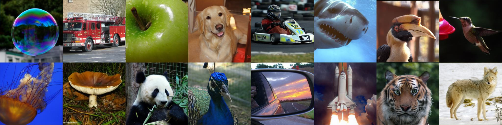
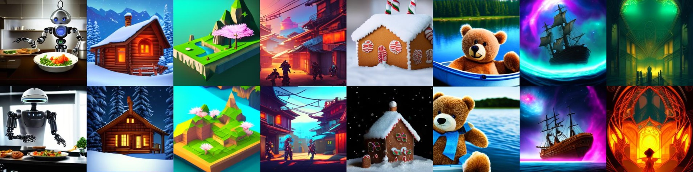

## 🌟 Halton Scheduler for Masked Generative Image Transformer 🌟

[](https://github.com/valeoai/Halton-MaskGIT/stargazers)
[](https://huggingface.co/llvictorll/Halton-MaskGIT/tree/main)
[](https://colab.research.google.com/github/valeoai/Halton-Maskgit/blob/main/colab_demo.ipynb)
[](LICENSE.txt)
[](https://openreview.net/forum?id=RDVrlWAb7K) 

Official PyTorch implementation of the paper:  
**Halton Scheduler for Masked Generative Image Transformer**  
*Victor Besnier, Mickael Chen, David Hurych, Eduardo Valle, Matthieu Cord*  
Accepted at **ICLR 2025**.

TL;DR: We introduce a new sampling strategy using the Halton Scheduler, which spreads tokens uniformly across the image.
This approach reduces sampling errors, and improves image quality.

---

## 🚀 Overview

Welcome to the official implementation of our ICLR 2025 paper! 🎉

This repository introduces **Halton Scheduler for Masked Generative Image Transformer (MaskGIT)** and includes:
1. **Class-to-Image Model**: Generates high-quality 384x384 images from ImageNet class labels.

<p align="center">
  
</p>

2. **Text-to-Image Model**: Generates realistic images from textual descriptions (coming soon)
<p align="center">
  
</p>

Explore, train, and extend our easy to use generative models! 🚀

The v1.0 version, previously known as "MaskGIT-pytorch" is available [here!](https://github.com/valeoai/Halton-MaskGIT/tree/v1.0)

---

## 📁 Repository Structure

```plaintext
├ Halton-MaskGIT/
|    ├── Congig/                                <- Base config file for the demo
|    |      ├── base_cls2img.yaml                                
|    |      └── base_txt2img.yaml               
|    ├── Dataset/                               <- Data loading utilities
|    |      ├── dataset.py                      <- PyTorch dataset class                   
|    |      └── dataloader.py                   <- PyTorch dataloader
|    ├── launch/                             
|    |      ├── run_cls_to_img.sh               <- Training script for class-to-image   
|    |      └── run_txt_to_img.sh               <- Training script for text-to-image (coming soon) 
|    ├── Metrics/                             
|    |      ├── extract_train_fid.py            <- Precompute FID stats for ImageNet    
|    |      ├── inception_metrics.py            <- Inception score and FID evaluation
|    |      └── sample_and_eval.py              <- Sampling and evaluation
|    ├── Network/                             
|    |      ├── ema.py                          <- EMA model 
|    |      ├── transformer.py                  <- Transformer for class-to-image   
|    |      ├── txt_transformer.py              <- Transformer for text-to-image (coming soon)
|    |      └── va_model.py                     <- VQGAN architecture  
|    ├── Sampler/                             
|    |      ├── confidence_sampler.py           <- Confidence scheduler   
|    |      └── halton_sampler.py               <- Halton scheduler  
|    ├── Trainer/                               <- Training classes
|    |      ├── abstract_trainer.py             <- Abstract trainer     
|    |      ├── cls_trainer.py                  <- Class-to-image trainer     
|    |      └── txt_trainer.py                  <- Text-to-image trainer (coming soon)
|    ├── statics/                               <- Sample images and assets
|    ├── saved_networks/                        <- placeholder for the downloaded models
|    ├── colab_demo.ipynb                       <- Inference demo 
|    ├── app.py                                 <- Gradio example
|    ├── LICENSE.txt                            <- MIT license
|    ├── env.yaml                               <- Environment setup file
|    ├── README.md                              <- This file! 📖
|    └── main.py                                <- Main script
```

## 🛠️ Usage
Get started with just a few steps:

### 1️⃣ Clone the repository

   ```bash
   git clone https://github.com/valeoai/Halton-MaskGIT.git
   cd Halton-MaskGIT
   ```

### 2️⃣ Install dependencies

   ```bash
   conda env create -f env.yaml
   conda activate maskgit
   ```

### 3️⃣ Download pretrained models

```python
from huggingface_hub import hf_hub_download
# The VQ-GAN
hf_hub_download(repo_id="FoundationVision/LlamaGen", 
                filename="vq_ds16_c2i.pt", 
                local_dir="./saved_networks/")

# (Optional) The MaskGIT
hf_hub_download(repo_id="llvictorll/Halton-Maskgit", 
                filename="ImageNet_384_large.pth", 
                local_dir="./saved_networks/")
```

### 4️⃣ Extract the code from the VQGAN

   ```bash
   python extract_vq_features.py --data_folder="/path/to/ImageNet/" --dest_folder="/your/path/" --bsize=256 --compile
   ```

### 5️⃣ Train the model

To train the class-to-image model:
   ```bash
   bash launch/run_cls_to_img.sh
   ```


## 📟 Quick Start for sampling
To quickly verify the functionality of our model, you can try this Python code:

```python
import torch
from Utils.utils import load_args_from_file
from Utils.viz import show_images_grid
from huggingface_hub import hf_hub_download

from Trainer.cls_trainer import MaskGIT
from Sampler.halton_sampler import HaltonSampler

config_path = "Config/base_cls2img.yaml"        # Path to your config file
args = load_args_from_file(config_path)
args.device = torch.device("cuda" if torch.cuda.is_available() else "cpu")

# Download the VQGAN from LlamaGen 
hf_hub_download(repo_id="FoundationVision/LlamaGen", 
                filename="vq_ds16_c2i.pt", 
                local_dir="./saved_networks/")

# Download the MaskGIT
hf_hub_download(repo_id="llvictorll/Halton-Maskgit", 
                filename="ImageNet_384_large.pth", 
                local_dir="./saved_networks/")

# Initialisation of the model
model = MaskGIT(args)

# select your scheduler
sampler = HaltonSampler(sm_temp_min=1, sm_temp_max=1.2, temp_pow=1, temp_warmup=0, w=2,
                        sched_pow=2, step=32, randomize=True, top_k=-1)

# [goldfish, chicken, tiger cat, hourglass, ship, dog, race car, airliner]
labels = [1, 7, 282, 604, 724, 179, 751, 404] 

gen_images = sampler(trainer=model, nb_sample=8, labels=labels, verbose=True)[0]
show_images_grid(gen_images)
```
or run the gradio 🖼️ app.py -->  ```python app.py ``` and connect to http://127.0.0.1:6006 on your navigator

🎨 Want to try the model, but you don't have a gpu? Check out the Colab Notebook for an easy-to-run demo! 
[](https://colab.research.google.com/github/valeoai/Halton-Maskgit/blob/main/colab_demo.ipynb)

## 🧠 Pretrained Models
The pretrained MaskGIT models are available on [Hugging Face](https://huggingface.co/llvictorll/Halton-MaskGIT/tree/main).
Use them to jump straight into inference or fine-tuning.

| Model                | # Params | # Input | # GFLOP | VQGAN |  MaskGIT                                                          | 
|----------------------|----------|---------|---------|--------|-------------------------------------------------------------------|
| Halton-MaskGIT-Large | 480M     | 24x24   | 83.00   | [🔗 Download](https://huggingface.co/FoundationVision/LlamaGen/blob/main/vq_ds16_c2i.pt)   |  [🔗 Download](https://huggingface.co/llvictorll/Halton-MaskGIT/blob/main/ImageNet_384_large.pth)  | 

## ❤️ Contribute
We welcome contributions and feedback! 🛠️
If you encounter any issues, have suggestions, or want to collaborate, feel free to:
 - Create an issue
 - Fork the repository and submit a pull request

Your input is highly valued. Let’s make this project even better together! 🙌

## 📜 License
This project is licensed under the MIT License.
See the [LICENSE](LICENSE.txt) file for details.

## 🙏 Acknowledgments
We are grateful for the support of the IT4I Karolina Cluster in the Czech Republic for powering our experiments.

The pretrained VQGAN ImageNet (f=16/8, 16384 codebook) is from the [LlamaGen official repository](https://github.com/FoundationVision/LlamaGen?tab=readme-ov-file)

## 📖 Citation
If you find our work useful, please cite us and add a star ⭐ to the repository :) 

```
@inproceedings{besnier2025iclr,
  title={Halton Scheduler for Masked Generative Image Transformer},
  author={Victor Besnier, Mickael Chen, David Hurych, Eduardo Valle, Matthieu Cord},
  booktitle={International Conference on Learning Representations (ICLR)},
  year={2025}
}
```

## ⭐ Stars History

[](https://star-history.com/#valeoai/Halton-MaskGIT&Date)
